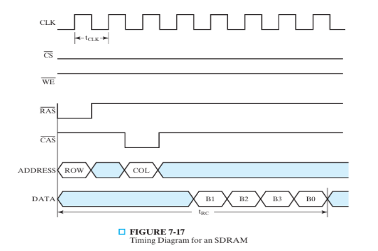
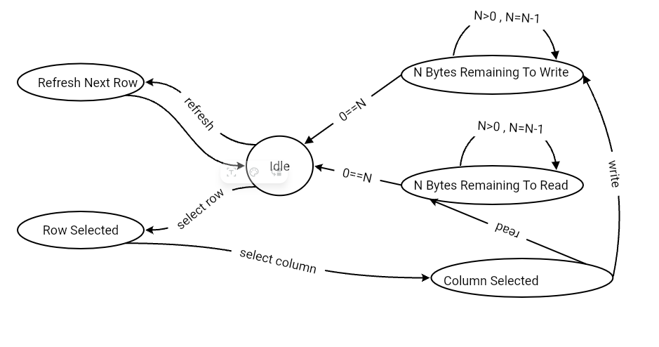
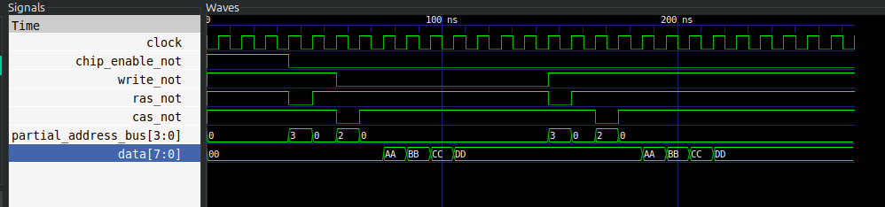

# SDRAM Design & Implementation Using System Verilog

## Prerequisites
1. Knowing the operation design of DRAM (using coincident selection).
2. Basice knoweledge of Verilog or System Verilog
### Required Software
1. A **System Verilog** compiler.
2. A vcd file viewer.
3. Or you may just install a System Verilog Simulation IDE.

Please use a search engine to find the right tools.

## Steps
### 1. Get to know the SDRAM
**SDRAM** or **Synchronous Dynamic Random Access Memory** is any DRAM where the operation of its external pin interface is coordinated by an externally supplied clock signal. <sup>[Wikipedia](https://en.wikipedia.org/wiki/Synchronous_dynamic_random-access_memory)</sup>

Being synchronous implies two things:
1. It is a finite state machine (like any sequential circuit).
2. Synchronization requires registers for input, output and other stuff.

Another thing SDRAMs are capable of is what is know as **burst read** and **burst write**, each of which means reading or writing multiple consecutive bytes per one read/write commmand. The number of bytes is knows as **burst length**. Each consecutive byte is transferred at a new positive edge.

### 2. Define the behaviour of an SDRAM
Any module can be defined by its inputs and outputs, and how inputs map to outputs. Also in case of sequential circuits, we have to take timing (or sequence of operations) into account.

SDRAM's inputs:
- $Clk$ : clock
- $\overline{CS}$ : chip select (active low)
- $\overline{WE}$ : write enable (active low)
- $\overline{RAS}$ : Row Access Strobe (active low)
- $\overline{CAS}$ : Column Access Strobe (active low)
- Address bus
- Data bus (both input and output)

As for timing (or operations sequence) it is best represented as time diagram. 

So below is the time diagram for read operation in SDRAM.



Notice that burst length here is four. Notice also that there should be an empty cycle between row address being sent, and column address, and the actual read/write operation. 

**Exercise: Try to make an exactly similar time diagram but for writing**

That being said SDRAM in addition to being able to read and write, it is able to refresh a row. 

SDRAM keeps track of the address of last refreshed row, and when it receives a refresh command it refreshes the next one.

As for how a refresh is signaled, we can assign it a signal that is not used by either read or write.

Read operation is triggerd by activating **RAS** then **CAS** all while **CS** is active and **WE** is unactive. Same goes for write operation except that **WE** is active.

With that in mind we may assign refresh to be triggered by activating **RAS** & **CAS** & **CS** simultaneously.

### 3. Identify the states of an SDRAM
**Exercise: Using the above understanding of SDRAM try to design a state machine that fullfills the above requirements. Use state diagram to represent your machine.**

We will go with the following state machine:


From the state diagram, the SDRAM has 6 state. It also has 3 possible commands to drive it through the state, these commands are:
1. Select Row (RAS & CS active , CAS inactive)
2. Select Column (CAS & CS active , RAS inactive)
3. Refresh Next Row (RAS & CAS & CS active)

### 4. Translate the state diagram to code
**Important Note: Make sure your compiler supports System Verilog, because we will use features that are not available in Verilog**

In our design data bus is 8 bits, and address is 8 bits as well, therefore address bus is 4 bits (because address is sent in two parts)

First define the module `SDRAM`

```verilog
module SDRAM (
    input wire [3:0] partial_address_bus,
    input wire clock,
    input wire chip_enable_not,
    input wire write_not,
    input wire ras_not,
    input wire cas_not,
    inout wire [7:0] data
);
// Your logic goes here
endmodule
```

Then we add some useful constants

```verilog
module SDRAM (
    input wire [3:0] partial_address_bus,
    input wire clock,
    input wire chip_enable_not,
    input wire write_not,
    input wire ras_not,
    input wire cas_not,
    inout wire [7:0] data
);
    localparam IS_IDLE          = 3'd0,
               IS_REFRESHING    = 3'd1,
               IS_ROW_SELECTED  = 3'd2,
               IS_COL_SELECTED  = 3'd3,
               IS_READING       = 3'd4,
               IS_WRITING       = 3'd5;

    localparam command_refresh       = 3'd0,
               command_select_row    = 3'd2,
               command_select_column = 3'd4;

    localparam BURST_LENGTH = 4;


endmodule
```

The first six constants are to define the states, and the three below are to define commands. The last one represents burst length of course.

Now let's define the memory cells matrix as a 2D array of registers (where a register represents a cell whose length is bits). Its dimensions are 16x16.

```verilog
    reg [7:0] memory [15:0][15:0];
```

> Note: In actual DRAMs, memory cells as you know are actually made with 1 transistor + 1 capacitor.

Now let's add a bunch of registers that represent the SDRAM's current state

```verilog
    reg [16*8-1:0] selected_row;
    reg [7:0] remaining_bytes = 0;
    reg [2:0] state = IS_IDLE;
    reg [3:0] last_refreshed_row = -4'd1;

    reg [3:0] row_address;
    reg [3:0] col_address;

    // The following two registers are both connected to data bus.
    reg [7:0] output_data_register;
    reg [7:0] input_data_register;
```

Now for convenience we may define a variable (wire) to represent current command

```verilog
    wire [2:0] command;
    assign command = {ras_not,cas_not,chip_enable_not};
```

Then please add the following line
```verilog
    assign data = (!chip_enable_not && write_not) ? output_data_register : 8'bz;
```
This line means if reading mode then connect data bus to output register. Otherwise set it to high impedance. Being set to high impedance means two things:
1. In case chip is not selected, SDRAM does not affect data bus at all.
2. It also allows data bus to be driven externally, allowing data to be read by SDRAM, in case of writing mode.

**Exercise: Use an LLM to understand this line more, and how it's represented as a tri-state buffer**

Before proceeding this should be how the code looks right now
```verilog
module SDRAM (
    input wire [3:0] partial_address_bus,
    input wire clock,
    input wire chip_enable_not,
    input wire write_not,
    input wire ras_not,
    input wire cas_not,
    inout wire [7:0] data
);

    localparam IS_IDLE          = 3'd0,
               IS_REFRESHING    = 3'd1,
               IS_ROW_SELECTED  = 3'd2,
               IS_COL_SELECTED  = 3'd3,
               IS_READING       = 3'd4,
               IS_WRITING       = 3'd5;

    localparam command_refresh       = 3'd0,
               command_select_row    = 3'd2,
               command_select_column = 3'd4;

    localparam BURST_LENGTH = 4;

    reg [7:0] memory [15:0][15:0];
    reg [16*8-1:0] selected_row;
    reg [7:0] remaining_bytes = 0;
    reg [2:0] state = IS_IDLE;
    reg [3:0] last_refreshed_row = -4'd1;

    reg [3:0] row_address;
    reg [3:0] col_address;

    reg [7:0] output_data_register;
    reg [7:0] input_data_register;

    wire [2:0] command;
    assign command = {ras_not,cas_not,chip_enable_not};

    assign data = (!chip_enable_not && write_not) ? output_data_register : 8'bz;

    // Your logic here

endmodule
```

Now add the following block
```verilog
    always @(posedge clock) begin
        // What to do at each positive edge
    end
```
What you put inside this block will be triggered at each positive edge of the clock variable.

Now inside it you may add the following case statment
```verilog
    always @(posedge clock) begin
        case (state)
            IS_IDLE : begin
                // TO DO
            end
            IS_REFRESHING : begin
                // TO DO
            end
            IS_ROW_SELECTED : begin
                // TO DO
            end
            IS_COL_SELECTED : begin
                // TO DO
            end
            IS_READING : begin
                // TO DO
            end
            IS_WRITING : begin
                // TO DO
            end
    end
```

You shoud be able to fill in the TODOs yourself from the state diagram above. Anyway add the following to functions at the bottom of the file to aid you in your implementation.

```verilog
function [16*8-1:0] get_row;
    input [7:0] mem [15:0];
    integer i;
    begin
        for (i = 0; i < 16; i = i + 1)
            get_row[i*8 +: 8] = mem[i];
    end
endfunction

// A task is like a function but it is capable of modifiying an external array
task put_row;
    input [16*8-1:0] row_data;   // wide data to write
    output [7:0] mem [15:0];     // memory row to update
    integer i;
    begin
        for (i = 0; i < 16; i = i + 1)
            mem[i] = row_data[i*8 +: 8];
    end
endtask
```

These two functions write will help you transfer an entire row between `memory` and `selected_row` register.

In your code you may use them as follows:
```verilog
put_row(selected_row , memory[row_address]);  
```
and
```verilog
selected_row = get_row(memory[row_address]);
```

At the end your code should look something like the following

```verilog
/* verilator lint_off CASEINCOMPLETE */
`timescale 1ns/1ps

// 8 bit address, 8 bit data block
module SDRAM (
    input wire [3:0] partial_address_bus,
    input wire clock,
    input wire chip_enable_not,
    input wire write_not,
    input wire ras_not,
    input wire cas_not,
    inout wire [7:0] data
);

    localparam IS_IDLE          = 3'd0,
               IS_REFRESHING    = 3'd1,
               IS_ROW_SELECTED  = 3'd2,
               IS_COL_SELECTED  = 3'd3,
               IS_READING       = 3'd4,
               IS_WRITING       = 3'd5;

    localparam command_refresh       = 3'd0,
               command_select_row    = 3'd2,
               command_select_column = 3'd4;

    localparam BURST_LENGTH = 4;

    reg [7:0] memory [15:0][15:0];
    reg [16*8-1:0] selected_row;
    reg [7:0] remaining_bytes = 0;
    reg [2:0] state = IS_IDLE;
    reg [3:0] last_refreshed_row = -4'd1;

    reg [3:0] row_address;
    reg [3:0] col_address;

    reg [7:0] output_data_register;
    reg [7:0] input_data_register;

    wire [2:0] command;
    assign command = {ras_not,cas_not,chip_enable_not};

    assign data = (!chip_enable_not && write_not) ? output_data_register : 8'bz;


    always @(posedge clock) begin
        case (state)
            IS_IDLE : begin
                case (command)
                    command_refresh : begin
                        state = IS_REFRESHING;
                    end 
                    command_select_row : begin
                        row_address = partial_address_bus;                 
                        selected_row = get_row(memory[row_address]); 
                        state = IS_ROW_SELECTED;
                    end
                endcase
            end
            IS_REFRESHING : begin
                last_refreshed_row++;
                selected_row = get_row(memory[last_refreshed_row]);  
                put_row(selected_row , memory[last_refreshed_row]);  
                state = IS_IDLE; 
            end
            IS_ROW_SELECTED : begin
                if(command == command_select_column) begin
                    remaining_bytes = BURST_LENGTH;
                    col_address = partial_address_bus;
                    state = IS_COL_SELECTED;
                end
            end
            IS_COL_SELECTED : begin
                if (write_not) begin // if read
                    state = IS_READING;
                end else begin       // if write
                    state = IS_WRITING;
                end
            end
            IS_READING : begin
                output_data_register = selected_row[col_address*8 +: 8];
                col_address++;
                remaining_bytes--;
                if (remaining_bytes == 0) 
                    state = IS_IDLE;
            end
            IS_WRITING : begin
                input_data_register = data;
                selected_row[col_address*8 +: 8] = input_data_register;
                col_address++;    
                remaining_bytes--;
                if (remaining_bytes == 0) begin
                    put_row(selected_row , memory[row_address]);  
                    state = IS_IDLE;    
                end
            end
        endcase
    end
    
endmodule

function [16*8-1:0] get_row;
    input [7:0] mem [15:0];
    integer i;
    begin
        for (i = 0; i < 16; i = i + 1)
            get_row[i*8 +: 8] = mem[i];
    end
endfunction

task put_row;
    input [16*8-1:0] row_data;   // wide data to write
    output [7:0] mem [15:0];     // memory row to update
    integer i;
    begin
        for (i = 0; i < 16; i = i + 1)
            mem[i] = row_data[i*8 +: 8];
    end
endtask
```

Copy and paste the first two lines in the above code in your code. The comment will eliminate an error that prevenets your code from running if case statment does not handle all cases. As for ``` `timescale 1ns/1ps ``` it will be useful when testing.

### 5. Write the test bench
The test bench is another module that is made for testing, you may just copy and paste the following code (in another file of course)
```verilog
`timescale 1ns/1ps

module tb_sdram;

    reg         clock = 0;
    reg [3:0]   partial_address_bus = 0;
    reg         chip_enable_not = 1;
    reg         write_not = 1;
    reg         ras_not = 1;
    reg         cas_not = 1;

    // Bidirectional data bus
    reg  [7:0]  data_out;       // what testbench wants to drive
    wire [7:0]  data;           // connected to SDRAM module
    assign data = (drive_data) ? data_out : 8'bz;

    reg drive_data = 0;         // control TB driving of inout bus

    // Instantiate DUT
    SDRAM dut (
        .partial_address_bus(partial_address_bus),
        .clock(clock),
        .chip_enable_not(chip_enable_not),
        .write_not(write_not),
        .ras_not(ras_not),
        .cas_not(cas_not),
        .data(data)
    );

    // Clock generation
    always #5 clock = ~clock;   // 100 MHz

    // ===== Helper tasks =====

    // Issue a row select command
    task select_row(input [3:0] row);
    begin
        @(posedge clock);
        partial_address_bus = row;
        chip_enable_not = 0; write_not = 1; ras_not = 0; cas_not = 1;  // command = 4
        @(posedge clock);
        ras_not = 1; // return to idle
        partial_address_bus = 4'bz;
    end
    endtask

    // Issue a column select command
    task select_column(input [3:0] col, input is_read);
    begin
        @(posedge clock);
        partial_address_bus = col;
        chip_enable_not = 0;
        write_not = is_read;   // 1=read, 0=write
        ras_not = 1;
        cas_not = 0;           // command = 8
        @(posedge clock);
        cas_not = 1; // return to idle
        partial_address_bus = 4'bz;
        @(posedge clock);
    end
    endtask

    // Write one data byte
    task write_byte(input [7:0] value);
    begin
        drive_data = 1;
        data_out = value;
        @(posedge clock);
    end
    endtask

    // Read one data byte
    task read_byte;
    begin
        drive_data = 0;   // release bus
        @(posedge clock);
        $display("Read byte: %02x", data);
    end
    endtask


    // ===== Test sequence =====
    initial begin
        $dumpfile("wave.vcd");   // for waveform
        $dumpvars(1, testbench);

        $display("=== SDRAM TEST START ===");

        chip_enable_not = 1;
        write_not = 1;
        ras_not = 1;
        cas_not = 1;

        repeat(3) @(posedge clock);

        // ---- WRITE BURST ----
        $display("\nWriting 4 bytes to row 3, col 2...");
        select_row(4'h3);
        select_column(4'h2, /*read=*/0);

        write_byte(8'hAA);
        write_byte(8'hBB);
        write_byte(8'hCC);
        write_byte(8'hDD);

        repeat(2) @(posedge clock);

        // ---- READ BURST ----
        $display("\nReading 4 bytes from row 3, col 2...");
        select_row(4'h3);
        select_column(4'h2, /*read=*/1);

        read_byte();
        read_byte();
        read_byte();
        read_byte();

        repeat(5) @(posedge clock);

        $display("=== SDRAM TEST END ===");
        $finish;
    end

endmodule
```

Upon running the above program it should produce the following output in the console (if not then revise your SDRAM implementation)
```
=== SDRAM TEST START ===

Writing 4 bytes to row 3, col 2...

Reading 4 bytes from row 3, col 2...
Read byte: aa
Read byte: bb
Read byte: cc
Read byte: dd
=== SDRAM TEST END ===
```

It should also produce a file named `wave.vcd` which represents the time diagram for your for a write operation followed by a read operation of these same written bytes.

To view that file, use a search engine for the following keywords `vcd viewer`. The app used here is called GtkWave.

Viewing `wave.vcd` in GtkWave


If something is not right in your output then please check your implementation, use `$display()` and `$monitor()` to debug your code.